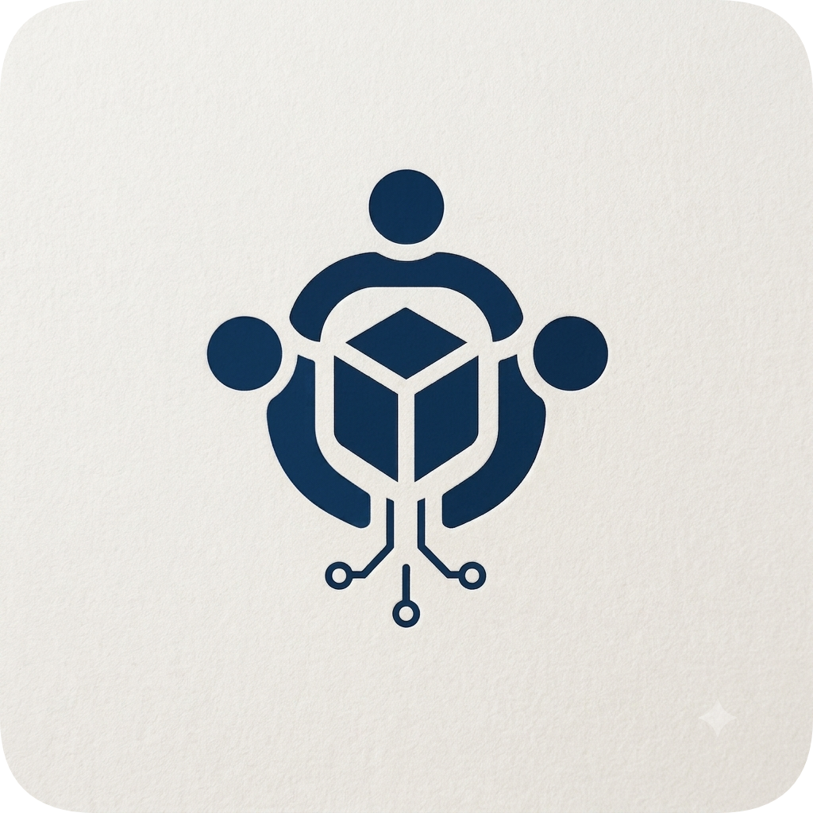

# CodexClava

  

  <strong>Build What You Wish Existed.</strong>

  A community of people who learn by building.

There are plenty of places to learn how to code: courses, exercises, to-do apps, certificates.

None of them teach you the hardest part: figuring out what to build.

That's where CodexClava starts. A blank repository, and one question: **"What should we build?"**

We build things. Break things. Argue about how to build them. Change our minds. Ship. Learn.

Then we do it again.

## What we're here to do

Build software that's worth building. Sometimes that's a serious project, sometimes a weird experiment, sometimes a tool that only solves a problem ten people have. What matters is that it starts with curiosity and ends with something real.

Our projects take many forms: open-source software, web and mobile apps, developer tools, AI experiments, infrastructure, security projects, research, automation, and things we haven't thought of yet. We'd rather leave room to explore than decide everything in advance.

## How we learn

The project is the classroom.

You learn databases when the database becomes the hardest part of what you're building. You learn distributed systems when one server isn't enough. You learn testing when a change breaks something you thought was unrelated. You learn Git when six people need to work on the same codebase without destroying each other's work. You learn leadership when a team needs someone to make a decision.

We care less about "finish the tutorial" and more about "let's figure this out."

## How we work

Ideas become discussions. Discussions become issues. Issues become pull requests. Pull requests get reviewed. Good work gets merged. Eventually, someone uses what we built.

You don't need permission to have an idea, expertise to contribute, or code to matter here. A good design, a thoughtful review, a useful investigation, a clear explanation, or a hard question moves a project forward just as much as a feature does.

## The people

Some of us have years of experience; some are writing their first serious program. Both belong here.

We don't want a community where beginners spectate while experienced people do all the work. We want people to **grow into responsibility**. Start with a small issue. Take a bigger one. Help someone else. Review someone's work. Lead a project. Start one.

Whoever joins today should have a path to leading tomorrow.

## What we care about

- **Curiosity.** Ask why.
- **Ownership.** If you see something worth fixing, do something about it.
- **Craft.** Small details compound.
- **Honesty.** If it doesn't work, say so.
- **Generosity.** Leave things better than you found them.
- **Ambition.** Try things that might be too difficult.
- **Humility.** Good ideas can come from anywhere.

## Open source

We build in public whenever we can, not because every project needs an audience, but because software becomes more valuable when knowledge doesn't stop with the person who wrote it.

If something we build can help people outside CodexClava, we want them to use it. If they can make it better, we want them to contribute. The repository shouldn't belong to whoever started it. **It should belong to whoever cares enough to improve it.**

## If you're new

Don't look for the perfect place to start. Look around. Find something interesting. Read the code. Ask a question. Fix something small. Open a pull request.

Your first contribution might be tiny. That's how most things begin.

## If you have an idea

Bring it. It doesn't need to be polished, need a pitch deck, or need a hundred users. It just needs to be interesting enough that you want to find out what happens if you build it.

Open an issue. Start a discussion. Find someone who wants to work on it. See where it goes.

## One day

We want someone to find a CodexClava repository years from now and actually use it. We want members to look back at their first pull request and barely recognize the developer who wrote it. We want projects to outlast their original creators.

We want people to arrive with an idea they couldn't build alone, and leave having built something they didn't think they could.

That's enough of a mission for us.

  <strong>CodexClava</strong> 
  <em>Build What You Wish Existed.</em>

